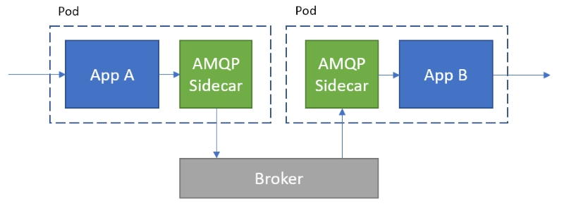

# AMQP Sidecar

[](https://circleci.com/gh/brbarnett/amqp-sidecar/tree/master)

The AMQP Sidecar is a companion app that logically decouples AMQP infrastucture code from your application logic. It seeks to accomplish the concept of transport independence in microservices. This accomplishes a few different goals:

- __Messaging cohesion__ - two apps that interact with a broker can be built as HTTP-only, which makes testing easier. It's difficult to test when messages are sent to an AMQP broker, but in this case there is more general observability.
- __Transport independence__ - the only difference between the synchronous and asynchronous paths is the URI. The messages are the same, and the functionality is configured at application runtime instead of during development.
- __Reusable infrastructure code__ - all of the broker infrastructure code is no longer a concern or dependency of the applications, so they can focus on what they're good at: delivering business value.

Here is a diagram of how messages flow with the AMQP Sidecar:



App A and App B can continue to rely on the HTTP protocol, but still achieve the benefits of a decoupled and resilient architecture.

## How to use it
You can currently find a Docker image at [brbarnett/amqp-sidecar](https://hub.docker.com/r/brbarnett/amqp-sidecar)

This app is designed to be a sidecar to a Kubernetes pod, but that is not a requirement. It requires a few configuration steps

### Global
In all use cases, the sidecare requires the following environment variables
```
RABBITMQ_HOSTNAME: message-broker-service
RABBITMQ_USERNAME: rabbitmqusername
RABBITMQ_PASSWORD: rabbitmqp@ssw0rd
```

### Publishing messages
No additional configuration is required to publish messages. To enqueue a message, send a request in this format to the sidecar

```
POST http://localhost:8000/{exchange}/{routingKey}
{
    ... any serialized object ...
}
```
_Note: the sidecar listens on port 8000_

### Consuming messages
The sidecar requires that a configuration file named `broker.json` is mounted to the ./config directory in the container. The config looks like this

```
{
    "rules": [
        {
            "exchange": "exchangename",
            "queue": "queuename",
            "routingKeys": [
                "queue.*"
            ],
            "endpointUri": "http://service-hostname"
        }
    ]
}
```

Any messages that are received for each rule are POSTed to the `endpointUri` as defined in configuration.